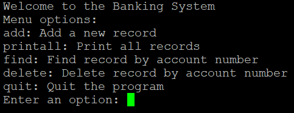

  

For this project, I developed a banking software application that combines concepts and tasks from what I learned about C in my ICS 212 class. The application consisted of a user-interface and a database module, each interacting seamlessly. The user-interface was responsible for managing user interactions, such as adding, finding, printing, and deleting records, while ensuring input validation for critical fields like account numbers. The database module implemented essential functionalities like adding records in sorted order, finding records by account number, and deleting specified records. Additionally, I implemented file I/O operations to persist records between program runs and ensured efficient memory management by releasing heap-allocated memory during cleanup. The project also involved creating a robust Makefile to compile the program into an executable named project and testing the application using a structured test plan.

Through this project, I learned to handle several important programming concepts and techniques. Managing linked lists to maintain sorted data structures deepened my understanding of pointers and dynamic memory allocation in C. Implementing file I/O operations helped me refine my ability to work with text files and EOF conditions, while adhering to stringent requirements such as avoiding special markers or metadata. Debugging and refining the user-interface emphasized the importance of clear interaction flows and error handling, ensuring the application is user-friendly and resilient to invalid inputs. By integrating these functions into a cohesive application, I gained practical experience in modular programming and debugging complex interdependent code.

The testing process was particularly enlightening, as it required designing comprehensive test cases and analyzing how each function performed under various scenarios. It emphasized the importance of verifying program correctness and documenting failures effectively. Writing the summary.txt report helped me develop a structured approach to communicating test results and identifying areas for improvement. Overall, this project not only reinforced my technical skills in C programming but also cultivated my ability to plan, execute, and document a complex software development lifecycle.
